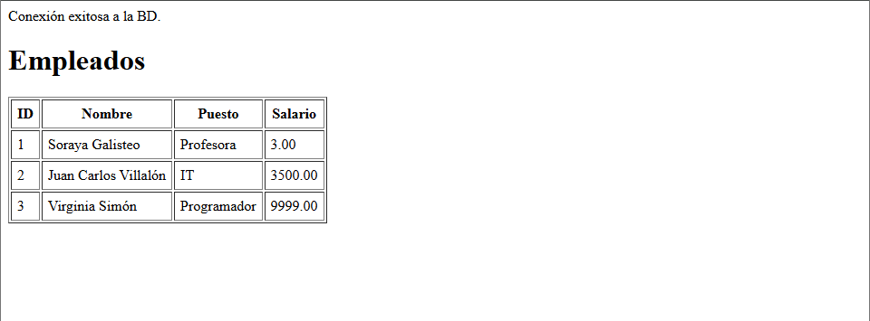
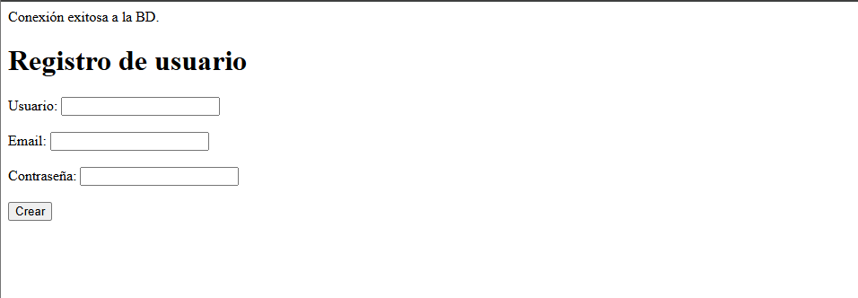
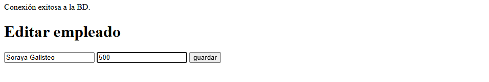

# UD 4

- [UD 4](#ud-4)
  - [creacion de la base de datos](#creacion-de-la-base-de-datos)
  - [/actividad1](#actividad1)
    - [1. config.php](#1-configphp)
    - [2. conexion.php](#2-conexionphp)
  - [/actividad2](#actividad2)
    - [listar\_empleados.php](#listar_empleadosphp)
  - [/actividad3](#actividad3)
    - [buscar\_empleado.php](#buscar_empleadophp)
  - [/actividad4](#actividad4)
  - [/actividad5](#actividad5)
    - [lista.php](#listaphp)
    - [eempleado.php](#eempleadophp)
    - [eliminar\_empleado.php](#eliminar_empleadophp)
  - [/actividad6](#actividad6)
    - [index.php](#indexphp)
    - [login.php](#loginphp)
    - [register.php](#registerphp)
    - [usuario.php](#usuariophp)
    - [usuarios\_lista.php](#usuarios_listaphp)
    - [editar\_usuario.php](#editar_usuariophp)
    - [eliminar\_usuario.php](#eliminar_usuariophp)


## creacion de la base de datos
Al inicializar MySQL y Apache en XAMPP fui a `localhost/phpmyadmin` para ver las bases de datos y desde ahí creé la base de datos `empresa`. Posteriormente con los scripts dado creé las tablas. 


## /actividad1

### 1. config.php
- Define los parámetros de conexión a la base de datos como constantes:
  - `DB_HOST` → dirección del servidor MySQL.
  - `DB_NAME` → nombre de la base de datos.
  - `DB_USER` → usuario de la base de datos.
  - `DB_PASS` → contraseña del usuario.
  - `DB_CHARSET` → codificación de caracteres.
- Construye la variable `$dsn` (Data Source Name) que PDO utiliza para conectarse a MySQL.

### 2. conexion.php
- Incluye `config.php` para usar los datos de conexión.
- Crea un objeto PDO (`$pdo`) usando el DSN, usuario y contraseña.
- Configura PDO con:
  - `PDO::ATTR_ERRMODE => PDO::ERRMODE_EXCEPTION` → para lanzar excepciones ante errores.
  - `PDO::ATTR_DEFAULT_FETCH_MODE => PDO::FETCH_ASSOC` → para obtener resultados como arrays asociativos.
- Usa `try/catch` para capturar errores de conexión y mostrarlos de manera segura.

## /actividad2

### listar_empleados.php
utilizo la conexión creada en conexion.php y la importo una vez con:
````php
require_once __DIR__ . '/../actividad1/conexion.php';
````
luego genero el statement y guardo en la variable empleados la ejecución de ese statement (select) utilizando fetchAll() y así luego poder recorrer los datos con un forEach y mostrar los datos en el html.



Si no hay registros, se muestra un mensaje indicando que no existen empleados.  

## /actividad3

### buscar_empleado.php

Incluye un formulario que mantiene el valor ingresado tras el envío usando `value="<?=htmlspecialchars($input_nombre)?>"`.  
Muestra resultados solo después de que se haya enviado el formulario, controlando la visualización con `$_SERVER['REQUEST_METHOD']==='POST'`.  
El `try/catch` captura errores específicos de la consulta, evitando que el script se rompa y mostrando un mensaje seguro.


## /actividad4


⬇️

⬇️

⬇️


Observamos que, efectivamente, Pepe se ha registrado con datos correctos y la contraseña se se encuentra oculta para nosotros.


## /actividad5

### lista.php

Este archivo se encarga de listar todos los empleados en la tabla empleados mostrándolos en una tabla como ya hicimos en la actividad2, solo que en este caso se permite editar y eliminar a estos empleados 😈


### eempleado.php

Se importa la conexión, se recoge el id desde GET y se aborta si no llega o si el empleado no existe.
Se hace una SELECT para precargar datos en el formulario.
Si llega POST, se toman nombre y salario enviados, se actualiza el registro con UPDATE usando prepare/execute y finalmente se redirige a `lista.php`.
Este archivo lo que muestra en we es un pequeño form con los valores actuales del empleado para poder editarlos.



### eliminar_empleado.php

Se importa conexión. Se recibe el id via GET y si no llega se corta la ejecución.
Se lanza un DELETE preparado por id y se redirige directamente a `lista.php`.

❗❗ borro a Soraya ❗❗


## /actividad6

### index.php
Pantalla inicial.  
Si hay sesión activa salta directamente a `usuario.php`.  
Si no, ofrece dos enlaces básicos: registro y login.

### login.php
Formulario para autenticarse.  
Busca el usuario por nombre en la tabla `usuarios`.  
Si el password hasheado coincide con `password_verify()`, crea la sesión y redirige a `usuario.php`.  
Si falla, muestra mensaje de error.

### register.php
Formulario de alta.  
Si los campos llegan correctos, hashea la contraseña, inserta el usuario en la BD y crea sesión automática para entrar ya logueado.  
Controla duplicado de email con un `try/catch` específico sobre el error 1062.

### usuario.php
Página privada.  
Solo se abre si existe sesión, de lo contrario redirige al login.  
Muestra saludo al usuario conectado y enlaces para ver la lista de usuarios o hacer logout.

### usuarios_lista.php
Página privada.  
Saca todos los usuarios de la tabla y los muestra en una tabla.  
Ofrece dos acciones por usuario: editar y eliminar.

### editar_usuario.php
Recibe id, carga los datos, los muestra en un formulario y al enviar actualiza nombre y email del usuario indicado.  
Después redirige a `usuarios_lista.php`.

### eliminar_usuario.php
Recibe id y ejecuta un DELETE directo del usuario.  
Después redirige a `usuarios_lista.php`.

